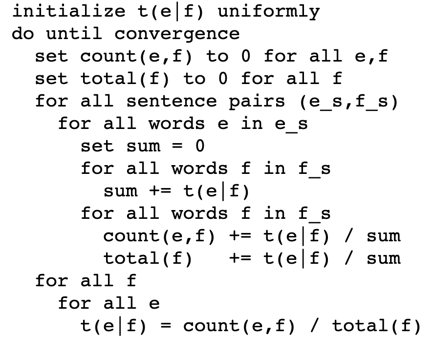

# Statistical Machine Translation

- [Statistical Machine Translation](#statistical-machine-translation)
  - [Introduction](#introduction)
  - [Implementation](#implementation)
  - [Results](#results)
  - [Sources](#sources)

## Introduction

Statistical machine translation (SMT) is a machine translation paradigm where translations are generated on the basis of statistical models whose parameters are derived from the analysis of bilingual text corpora.

The idea behind statistical machine translation comes from information theory. A document is translated according to the probability distribution  that a string  in the target language (for example, English) is the translation of a string in the source language (for example, French).

The problem of modeling the probability distribution  has been approached in a number of ways.  One approach which lends itself well to computer implementation is to apply Bayes Theorem, that is , where the translation model  is the probability that the source string is the translation of the target string, and the language model  is the probability of seeing that target language string. This decomposition is attractive as it splits the problem into two subproblems. Finding the best translation  is done by picking up the one that gives the highest probability:


This repository houses a single notebook that performs word-based machine translation similar to IBM Model 1. The sequences of words are called blocks or phrases, but typically are not linguistic phrases, but phrasemes found using statistical methods from corpora. The chosen phrases are further mapped one-to-one based on a phrase  translation table, and may be reordered. This table can be learnt based  on word-alignment, or directly from a parallel corpus. The model is then trained using the expectation maximization algorithm, similarly to the word-based IBM model.

## Implementation

1. An aligned corpus is used to learn the word-translation probabilities

2. An alignment table for each sentence pair in the parallel-corpora is generated, using the following pseudo-code -

   

   

## Results

German to English -

```
Sentence:  wiederaufnahme der sitzungsperiode 

wiederaufnahme -> resumption
der -> of resumption
sitzungsperiode -> session resumption
```

Another example, French to English -

```
Sentence:  je reprise session parlement vendredi 17 décembre dernier et vous vux que . 

je -> like i
reprise -> session
session -> session
parlement -> parliament
vendredi -> friday
17 -> 17
décembre -> december
dernier -> friday
et -> and
vous -> you
vux -> happy
que -> that
. -> .
```

## Sources

- Wikipedia article on Statistical Machine Translation